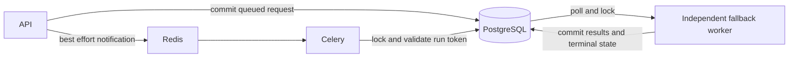

# Redis outage architecture

Redis is optional: leave `REDIS_URL` unset or empty and run the API plus
`python -m app.workers.fallback_worker` with `RECONCILIATION_MODE=async`.
Production still requires a strong secret and HTTPS frontend URL; Railway also
requires shared S3 storage. Apply migrations before starting the services.
No Celery worker or beat is needed in this mode. Redis probes/publications are
skipped, and readiness reports `ready` with Redis/Celery `disabled` when the
database and fallback heartbeat are healthy. See `../RAILWAY.md` for deployment.

PostgreSQL is authoritative for jobs, results, exports, run tokens, and rate
limits. Redis is a best-effort Celery transport. An independent fallback worker
must run alongside the API and Celery worker with the same database and shared
storage. This tolerates Redis outages and message loss while PostgreSQL and
storage remain available; it does not provide database or storage failover.

## Detection and transition

A process-local circuit breaker probes Redis with one-second connect and read
timeouts. A probe or publication failure opens the circuit. Calls skip Redis
during a five-second cooldown. Recovery requires two successful probes separated
by the cooldown; failure resets the count. Circuit transitions and publish
failures are logged through `recon`. Different processes may observe different
states without compromising consistency.

The API commits QUEUED state, run token, actor and enqueue timestamp together
before publishing. Exports commit PENDING before publishing. Publish failure
leaves accepted work queued in PostgreSQL. There is no volatile local queue.

The fallback polls every two seconds, considering pending work immediately when
Redis is unavailable. With healthy Redis, it gives Celery a thirty-second grace
period. It keeps polling after recovery, covering messages lost between database
commit and publication or lost inside Redis. Grace uses the enqueue time even
when retrying an old job. Legacy queued rows without timestamps are immediately
eligible. Each cycle processes at most one reconciliation and one export, and
runs expiry maintenance once per minute. Backlog and task duration affect delay;
the polling interval is not a completion-time SLA.

## Consistency and recovery

Consumers serialize on PostgreSQL row locks. Fallback consumers use
`FOR UPDATE SKIP LOCKED` to skip busy rows. Reconciliation holds its lock through
result replacement, audit/notification creation and terminal-state commit.
PROCESSING is flushed within that transaction: a worker crash rolls back to
QUEUED and releases the lock. Export generation uses existing row locks and
run-token validation.

Delivery is at least once. COMPLETED and FAILED attempts are terminal; stale
tokens cannot overwrite a newer attempt. Restored Redis messages either perform
pending work or become no-ops; stale tokens are rejected. No reverse cache merge
is needed because durable writes always used PostgreSQL. New notifications resume
after the circuit closes while polling drains the remaining backlog.

Database connection failures leave queued work recoverable by later polls and
Celery's bounded retry. Processing errors become FAILED; users retry with a new
token. Export writes use deterministic private storage keys, but a crash between
object storage and database commit can leave an orphan object. Keep storage
lifecycle policies enabled; those writes are not part of the database transaction.

## Authentication and health

Rate limits use atomic PostgreSQL UPSERT/RETURNING and windowed, hashed keys shared
across replicas. Counts commit even when over the limit. Expired buckets are
removed by the fallback worker. Counters stay in PostgreSQL before, during and
after recovery, avoiding resets or conflicting stores. Database failure makes
sign-in fail closed with HTTP 503. Deployment starts fresh buckets instead of
importing old Redis counts; deploy at a window boundary or pause authentication
briefly if preserving in-flight counts is necessary.

The fallback writes a heartbeat every five seconds. `/health/ready` returns
HTTP 200 with `status: degraded` during a Redis/Celery outage when PostgreSQL and
a fallback heartbeat younger than twenty seconds are available. It returns 503
when neither execution path is healthy. A cycle exceeding thirty minutes stops
advertising fallback health. Supervise/restart hung processes: this worker does
not forcibly interrupt Python tasks. `/health/live` remains process liveness.
Heartbeat health indicates execution capacity, not a queue-latency guarantee.

## Deployment

1. Run `python -m alembic upgrade head` from `backend` before starting new code.
   Revision `20260920_03` adds queue metadata, polling indexes, rate buckets and
   worker heartbeats. Use the normal database backup/deployment process.
2. Start `python -m app.workers.fallback_worker` as a separately supervised service
   with the API's database, storage and encryption settings. Railway needs another
   service with this command and shared S3. Execution and heartbeat require at
   least two database connections.
3. Both Compose definitions include `fallback-worker`; the API no longer waits
   for Redis startup. Prefer the root production Compose file, or explicitly
   select `backend/docker-compose.yml` to avoid its development override.
4. Scale fallback processes for outage capacity. Each executes one reconciliation
   at a time. Include their pools in `scripts/check_connection_budget.py`.
5. Monitor queue count/age, failed jobs, pending exports, heartbeat age, database
   capacity and circuit logs. Alert on persistent degraded health. Keep the
   fallback running after Redis recovery for lost-message recovery.

| Setting | Default | Purpose |
| --- | --- | --- |
| `REDIS_PROBE_INTERVAL` | 5 seconds | Probe interval and circuit cooldown |
| `REDIS_RECOVERY_PROBES` | 2 | Consecutive successful recovery probes |
| `FALLBACK_POLL_SECONDS` | 2 seconds | Idle/retry poll interval |
| `FALLBACK_GRACE_SECONDS` | 30 seconds | Celery grace when Redis is healthy |

Set these in each service's runtime environment. The root Compose file forwards
them from its environment file.

## Verification and staging drill

Run `python -m unittest discover -s tests -v` from `backend`. Tests cover circuit
cooldown/recovery, ambiguous publication, durable enqueue, fallback draining,
healthy-broker grace, terminal/stale deliveries, exports, database disconnection,
rate limits and degraded readiness. SQLite verifies transitions, not PostgreSQL
locking. Optional PostgreSQL tests use an isolated schema with `TEST_POSTGRES_URL`.

1. Submit reconciliations and exports; record job IDs and tokens.
2. Run `docker compose stop redis`. Submit more work and authentication attempts.
   Verify work completes through fallback, limits still apply and readiness is
   degraded/200.
3. Restart a busy fallback worker and verify uncommitted work is recovered.
4. Run `docker compose start redis`. Wait for recovery probes and Celery
   reconnection. Verify new tasks use Celery, pending work drains and replayed
   messages do not duplicate results or completion notifications.
5. Stop both execution workers with Redis down. Verify readiness becomes 503
   after heartbeat expiry. Restart workers and verify recovery.

References: [PostgreSQL queue locking](https://www.postgresql.org/docs/current/sql-select.html)
and [Celery delivery/idempotency](https://docs.celeryq.dev/en/stable/userguide/tasks.html).
